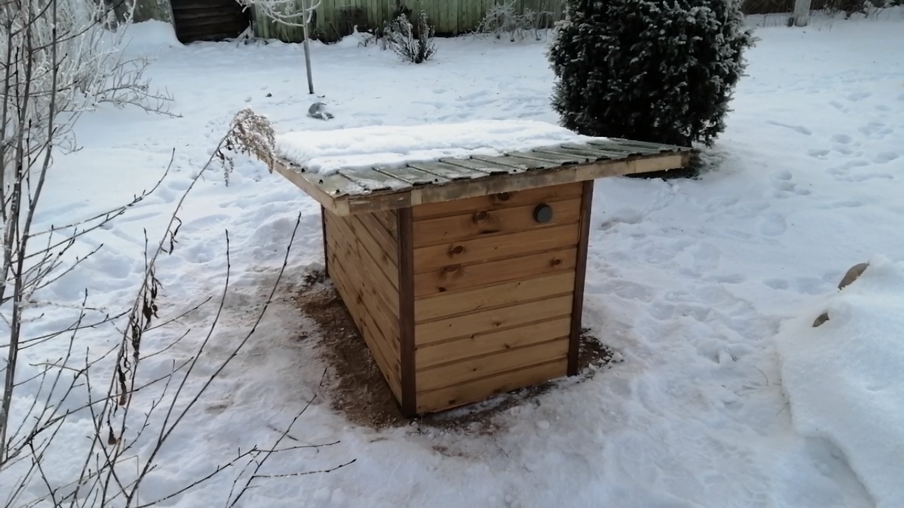

# wellCabin
Антикессон.

Проект домика над водозаборной скважиной.  
Поддержание микроклимата внутри неё на базе микроконтроллера ESP32.
Начинка контроллера - на базе типового [коннектора](https://github.com/Vovaman/connectorESP).
Сбор данных по температуре, давлению в [Peresvet](https://github.com/Vovaman/peresvet).
Проект описывает не конструкцию домушки, а её автоматизацию.

## Файлы
[aliexpress.md](aliexpress.md) - ccылки на использованные в проекте элементы.
[теория.md](теория.md) - cсылки на полезные статьи.
[теплопотери.ods](теплопотери.ods) - упрощённый расчёт теплопотерь через стены-крыш-пол домушки.
При расчёте пренебрегаем:
1. многослойностью стен и крыши, учитываем только
утеплитель.
2. направленностью стен по сторонам света
3. наличием щелей в конструкциях
4. зимой домушка будет практически вся занесена снегом,
   что резко снизит теплопотери.

## Конечный результат
Микроклимат регулируются помещённым в домушку микроконтроллером ESP32. 
Данные телеметрии собираются в Peresvet и могут просматриваться на экранах Grafana.
