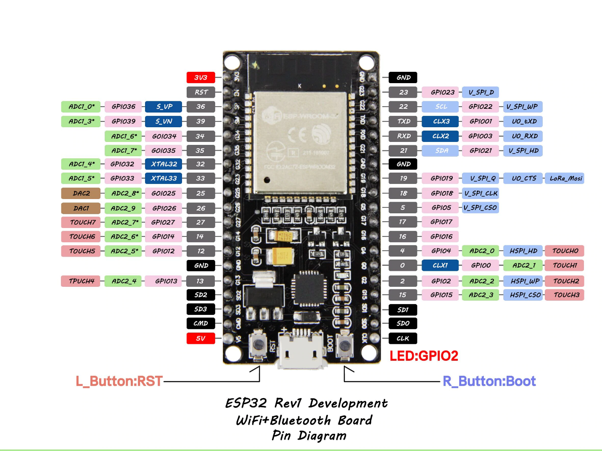
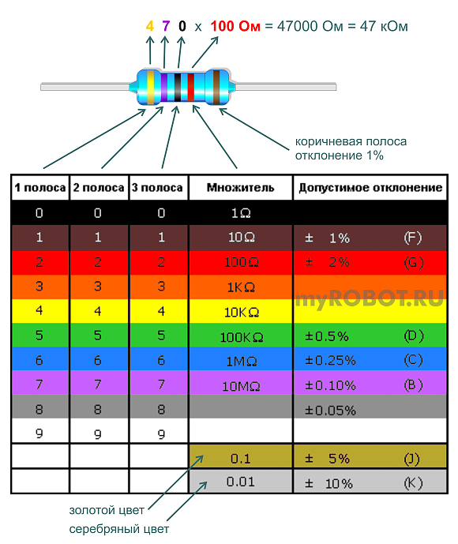
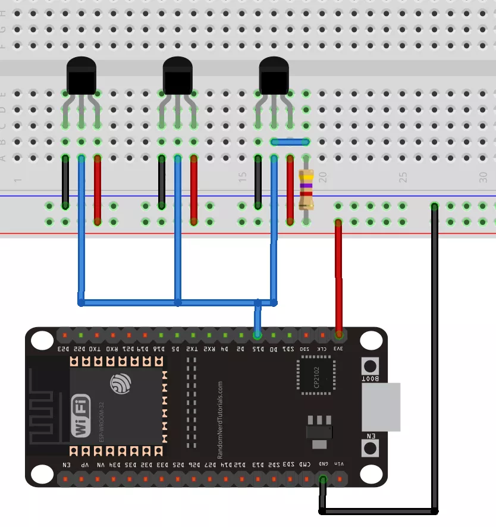

Статьи на Амперка.ру
--------------------
Базовые вопросы: схемы, элементы, тестовые проекты и много другого полезного.
http://wiki.amperka.ru/конспект-arduino

Макетная плата
--------------
Как с ней работать: http://wiki.amperka.ru/конспект-arduino:быстрая-сборка-схем

Распиновка ESP32 Dev kit
------------------------
Изображение: https://predictabledesigns.com/esp32-wireless-microcontroller-as-a-general-purpose-processor-using-the-arduino-ide/

Распиновка: https://diytech.ru/projects/spravochnik-po-raspinovke-esp32-kakie-vyvody-gpio-sleduet-ispolzovat
> Картинки в статье не соответствуют используемому в настоящем проекте
> варианту исполнения ESP32, но сама статья даёт представление о назначении
> выводов микроконтроллера.

Маркировка резисторов
---------------------

Подключение датчиков температуры DS18B20
----------------------------------------

